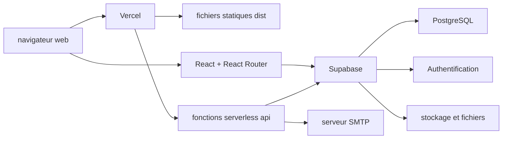

# Architecture technique d'EmploiPlus Group

## 1. Vue d'ensemble

EmploiPlus Group est une application web de recrutement et de services RH. Elle propose :

- un site public pour consulter les services, les offres d'emploi et les articles ;
- un espace candidat pour l'inscription, le profil, les documents, le CV et les candidatures ;
- un espace d'administration pour gérer les offres, les candidats, le blog, les notifications, l'équipe et le SEO ;
- des fonctions backend pour les emails, la réinitialisation du mot de passe, l'application mobile et l'assistant Maelise.

L'architecture est principalement une SPA React servie comme site statique, enrichie par un prérendu HTML des routes publiques et par des fonctions serverless déployées sur Vercel.



## 2. Technologies utilisées

### Frontend

- **React 19** et **React DOM** pour l'interface utilisateur.
- **TypeScript 5** en mode strict pour le typage.
- **Vite 8** pour le serveur de développement, le bundling et la production.
- **React Router 6** pour le routage côté client.
- **Tailwind CSS 4** via le plugin Vite pour les styles utilitaires.
- **Radix UI** et des composants internes pour les primitives d'interface accessibles.
- **React Hook Form** et **Zod** pour les formulaires et la validation.
- **Framer Motion** pour les animations.
- **React Helmet Async** pour la gestion des métadonnées SEO.
- **React Markdown**, `remark-gfm`, `rehype-raw` et `rehype-sanitize` pour afficher les contenus éditoriaux Markdown de façon contrôlée.
- **Vercel Analytics** pour les statistiques de fréquentation.

Les polices utilisées sont Inter et Plus Jakarta Sans, chargées via `@fontsource`.

### Backend et services

- **Supabase** fournit la base PostgreSQL, l'authentification, les règles RLS et le stockage associé au projet.
- **Fonctions serverless Vercel** dans le dossier `api/` pour les opérations nécessitant un environnement serveur ou des secrets.
- **Express** est utilisé localement par le script de prérendu pour servir le build pendant le rendu Puppeteer.
- **Puppeteer** génère des pages HTML prérendues à partir de l'application construite.
- **Nodemailer** envoie les emails transactionnels via un serveur SMTP.
- **Google APIs**, `pdfjs-dist`, `jspdf` et les bibliothèques d'analyse sont utilisés par certaines fonctions métier liées aux documents, aux CV et à l'analyse.

## 3. Organisation du code

Les principaux dossiers sont organisés par responsabilité :

- `src/main.tsx` : point d'entrée React et montage des providers globaux.
- `src/App.tsx` : définition des routes, layouts et chargements différés des pages.
- `src/components/` : composants d'interface réutilisables.
- `src/components/ui/` : primitives UI partagées.
- `src/pages/public/` : pages publiques.
- `src/pages/candidate/` : pages de l'espace candidat.
- `src/pages/admin/` : pages de l'administration.
- `src/features/` : modules métier par domaine, notamment authentification, candidats, offres, SEO et Maelise.
- `src/contexts/` : états transverses, par exemple le mode écologique et la navigation candidat.
- `src/integrations/supabase/` : clients et intégration Supabase.
- `src/hooks/`, `src/services/`, `src/utils/` : hooks, services applicatifs et utilitaires.
- `src/data/` et `src/constants/` : données et constantes partagées.
- `api/` : endpoints HTTP serverless exécutés côté Vercel.
- `server/` : logique serveur réutilisable, notamment emails et réinitialisation du mot de passe.
- `supabase/migrations/` : évolution versionnée du schéma et des politiques Supabase.
- `scripts/` : prérendu, diagnostics, génération d'embeddings et outils de maintenance.
- `tests/` : tests automatisés présents dans le dépôt.

L'alias TypeScript `@/*` pointe vers `src/*`.

## 4. Démarrage de l'application

Le point d'entrée `src/main.tsx` initialise les couches globales suivantes :

1. `React.StrictMode` pour les contrôles React en développement ;
2. `HelmetProvider` pour les métadonnées documentaires ;
3. `EcoModeProvider` pour le mode écologique ;
4. `BrowserRouter` pour la navigation côté client ;
5. `ErrorBoundary` pour isoler les erreurs d'interface ;
6. `Analytics` de Vercel pour la mesure d'audience.

`App.tsx` compose ensuite le contexte d'internationalisation, l'authentification, les layouts public/candidat/admin, les routes protégées et le widget Maelise. Les pages secondaires sont chargées avec `React.lazy` et `Suspense` afin de réduire le poids du chemin initial.

## 5. Routage et interfaces

Le routage est assuré par React Router avec plusieurs zones fonctionnelles :

- **zone publique** : accueil, services, offres, blog, contact, FAQ et documents légaux ;
- **zone candidat** : connexion, inscription, confirmation, récupération de mot de passe, onboarding, tableau de bord, profil, CV, documents et candidatures ;
- **zone administration** : tableau de bord, offres, blog, candidats, équipe, notifications, FAQ, SEO et documents légaux.

Les routes protégées utilisent les guards d'authentification et les permissions dérivées des rôles. Les rôles présents dans le code comprennent notamment `super_admin`, `admin`, `editor`, `candidate`, `rh`, `company`, `manager`, `accountant` et `recruiter`.

## 6. Données, authentification et autorisations

Le client Supabase est créé dans `src/integrations/supabase/client.ts` avec :

- `VITE_SUPABASE_URL` ;
- `VITE_SUPABASE_ANON_KEY` ;
- persistance de session dans `localStorage` ;
- renouvellement automatique du token ;
- clé de stockage `emploiplus-auth-token`.

`AuthContext` constitue la source d'état de session côté frontend. Il récupère la session Supabase, normalise les rôles présents dans les métadonnées, déduit les permissions et détecte l'existence d'un profil candidat.

Les autorisations sont centralisées dans `src/features/authentication/permissions/rolePermissions.ts`. La protection complète doit être assurée par les deux niveaux suivants :

- contrôle d'accès dans l'interface et les routes React ;
- politiques RLS et contrôles côté Supabase ou côté serverless pour empêcher un accès non autorisé direct à l'API.

Les migrations Supabase versionnent les fonctionnalités et la sécurité de la base, notamment les profils candidats, les documents, l'onboarding, les notifications, les conversations Maelise, les quotas, la limitation de débit, l'analyse IA et la recherche par vecteurs.

## 7. API et fonctions serverless

Les fichiers TypeScript du dossier `api/` sont exposés comme endpoints Vercel. Les principaux domaines couverts sont :

- confirmation, inscription et statut de confirmation email ;
- récupération et validation du mot de passe ;
- envoi d'emails transactionnels ;
- intégration mobile ;
- permissions et conversation de Maelise ;
- FAQ et analyse Groq.

En développement, le plugin `devApiHandlerPlugin` de `vite.config.ts` intercepte les requêtes `/api/*`, charge dynamiquement le fichier `api/<route>.ts` et l'exécute dans un adaptateur compatible avec les objets request/response Vercel.

En production, `vercel.json` conserve les routes `/api` comme fonctions serverless et redirige les routes applicatives vers `index.html` afin que React Router puisse les traiter. Certaines URLs historiques sont réécrites vers les endpoints correspondants, par exemple les étapes de réinitialisation du mot de passe et l'envoi d'email.

## 8. Emails et communications

Les fonctions serveur utilisent Nodemailer et un serveur SMTP configuré par variables d'environnement. Les cas couverts incluent notamment :

- emails de confirmation et codes de vérification ;
- réinitialisation du mot de passe ;
- messages liés aux candidatures ;
- notifications transactionnelles.

Le flux mobile de `api/mobile.ts` utilise Supabase avec une clé de service côté serveur, crée ou met à jour les données nécessaires et signe les liens de confirmation avec un HMAC. Ces secrets ne doivent jamais être exposés au frontend.

## 9. Build, prérendu et SEO

La commande de production est :

```text
npm run build
```

Elle exécute successivement :

1. `vite build`, qui génère les fichiers statiques dans `dist/` ;
2. `node scripts/prerender.js`, qui lance un serveur Express local sur le build ;
3. Puppeteer, qui rend les routes publiques et écrit des fichiers `index.html` par route.

Les routes statiques prérendues comprennent notamment `/`, `/about`, `/services`, `/jobs`, `/blog` et `/contact`. Les routes dynamiques des offres et des articles sont récupérées depuis les tables Supabase `job_offers` et `blog_posts`.

Le build génère également :

- `sitemap.xml` via le plugin personnalisé de `vite.config.ts` ;
- les URLs dynamiques d'offres et d'articles dans le sitemap ;
- `404.html` à partir de `index.html` ;
- les balises `title`, description, canonical, Open Graph et Twitter pour les pages prérendues.

## 10. Déploiement

Le déploiement cible est **Vercel**, avec une intégration au dépôt GitHub indiquée dans les pages légales et une configuration `vercel.json` à la racine.

Configuration actuelle :

- commande de build : `npm run build` ;
- dossier publié : `dist` ;
- fallback des routes frontend vers `/index.html` ;
- endpoints backend exposés sous `/api` ;
- en-têtes CORS spécifiques pour l'endpoint mobile.

Les variables secrètes doivent être configurées dans l'environnement Vercel et ne doivent pas être commitées. La configuration locale peut utiliser un fichier `.env.local` non versionné.

## 11. Variables d'environnement principales

Les noms exacts peuvent varier selon le contexte local, le build et les fonctions serverless. Les catégories utilisées par le code sont :

| Catégorie | Variables ou exemples |
| --- | --- |
| Supabase frontend | `VITE_SUPABASE_URL`, `VITE_SUPABASE_ANON_KEY` |
| Supabase serveur | `SUPABASE_URL`, `SUPABASE_SERVICE_ROLE_KEY`, clés publishable/anon selon le script |
| IA et analyse | `VITE_GEMINI_API_KEY`, variables des fournisseurs d'analyse |
| SMTP | `SMTP_HOST`, `SMTP_PORT`, `SMTP_USER`, `SMTP_PASS` |
| Emails | `FROM_EMAIL`, `FROM_NAME`, `SUPPORT_EMAIL` |
| Sécurité | `EMAIL_SIGNING_SECRET` |
| Mobile et liens | `DEEP_LINK_URL`, `SITE_URL`, `LOGO_URL`, `WHATSAPP_URL` |
| Prérendu | `PUPPETEER_EXECUTABLE_PATH` si le navigateur n'est pas détecté automatiquement |

Les clés `VITE_*` sont intégrées au bundle frontend. Elles ne doivent donc contenir que des valeurs destinées à être publiques, comme l'URL Supabase et la clé anonyme. Les clés de service, mots de passe SMTP et secrets HMAC restent exclusivement côté serveur.

## 12. Développement local

Prérequis déclarés dans `package.json` : Node.js 24.x et npm 10.x.

Commandes principales :

```bash
npm install
npm run dev
npm run build
npm run preview
npm run lint
npm run format
```

Le script `postinstall` installe le navigateur Chrome utilisé par Puppeteer. La présence des variables Supabase est nécessaire au démarrage du client frontend et au chargement des routes dynamiques pendant le prérendu.

## 13. Qualité et validation

Les contrôles disponibles dans le dépôt comprennent :

- TypeScript en mode strict via `tsconfig.json` ;
- ESLint via `npm run lint` ;
- formatage Prettier via `npm run format` ;
- tests présents dans `tests/` ;
- scripts de diagnostic dans `scripts/` et rapports dans `diagnostic-reports/`.

Il n'existe pas actuellement de script `test` dédié dans `package.json`. Les tests doivent donc être exécutés avec l'outil ou la configuration associée au fichier concerné, ou faire l'objet d'une commande npm dédiée dans une évolution ultérieure.

## 14. Points d'attention d'exploitation

- Vérifier les politiques RLS après chaque évolution de table ou de rôle.
- Ne jamais utiliser `SUPABASE_SERVICE_ROLE_KEY`, les identifiants SMTP ou `EMAIL_SIGNING_SECRET` dans le code client.
- Tester le prérendu avec les données Supabase disponibles avant un déploiement SEO important.
- Contrôler les routes Vercel après toute modification de `vercel.json`.
- Surveiller les limites et quotas associés à Maelise, aux emails et aux fonctions serverless.
- Maintenir les migrations Supabase dans le dépôt afin que les environnements restent reproductibles.
