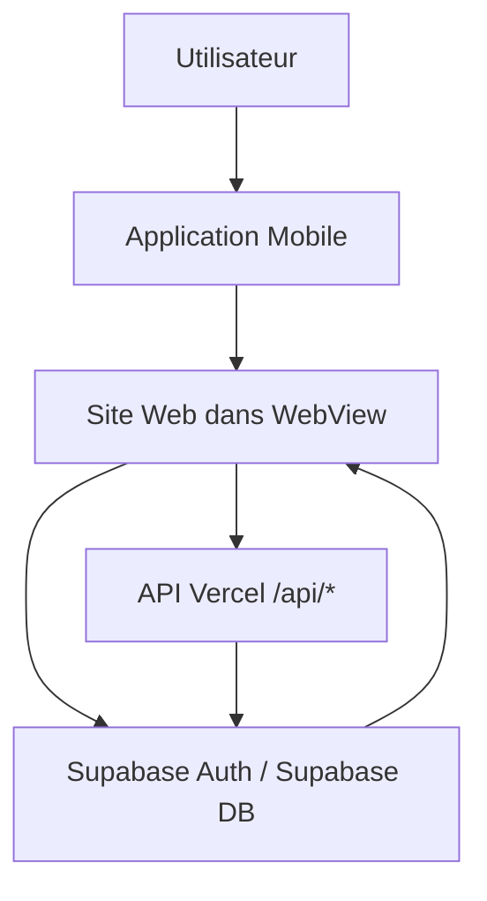

# Intégration Web ↔ Mobile — configuration actuelle

Ce document décrit uniquement l’architecture réellement présente dans le dépôt. Il ne décrit ni un projet React Native séparé, ni une architecture future, ni des hypothèses de conception.

## 1. Architecture générale

### 1.1 Type d’application

Le dépôt contient un site web React front-end construit avec Vite.

Faits vérifiés dans le code :
- [package.json](package.json) contient `react`, `react-dom`, `vite`, `@vitejs/plugin-react`.
- [vite.config.ts](vite.config.ts) configure Vite.
- [src/App.tsx](src/App.tsx) est l’application principale sous React Router.
- Il n’y a pas de code React Native dans ce workspace : aucun dossier `android`, `ios`, `expo`, `react-native` n’est présent dans le dépôt visible.

### 1.2 Structure globale liée au mobile

Le seul mécanisme explicite de compatibilité mobile dans le code est la détection d’un environnement “application mobile” via User-Agent.

Fichiers concernés :
- [src/lib/isMobileApp.ts](src/lib/isMobileApp.ts)
- [src/App.tsx](src/App.tsx)
- [src/styles.css](src/styles.css)
- [src/components/site/PublicLayout.tsx](src/components/site/PublicLayout.tsx)
- [src/components/candidate/CandidateSidebar.tsx](src/components/candidate/CandidateSidebar.tsx)

Le code détecte le mode app mobile via :

```ts
return navigator.userAgent.includes("EmploiPlusApp");
```

Dans [src/App.tsx](src/App.tsx), si `mobileApp` est vrai, la route est limitée à un sous-ensemble de chemins autorisés :

- `/jobs`
- `/jobs/*`
- `/candidate`
- `/candidate/*`

Tout autre chemin redirige vers `/jobs`.

Cela montre que le site web est conçu pour être affiché dans une WebView mobile, mais ce dépôt ne contient pas la partie native mobile elle-même.

### 1.3 Présence d’API internes ou externes

Le projet expose à la fois :

1. un accès direct à Supabase depuis le frontend
2. des endpoints Vercel sous [api/](api/)

Exemples réels :
- [api/register.ts](api/register.ts)
- [api/confirm.ts](api/confirm.ts)
- [api/resend-confirmation.ts](api/resend-confirmation.ts)
- [api/password-reset-request.ts](api/password-reset-request.ts)
- [api/password-reset-confirm.ts](api/password-reset-confirm.ts)
- [api/send-email.ts](api/send-email.ts)
- [api/faqs.ts](api/faqs.ts)
- [api/faq-categories.ts](api/faq-categories.ts)

Les routes Vercel sont également déclarées dans [vercel.json](vercel.json).

### 1.4 Utilisation de Supabase

Supabase est le cœur technique de la persistance et de l’authentification.

Le client est initialisé dans [src/integrations/supabase/client.ts](src/integrations/supabase/client.ts) :

```ts
const supabaseUrl = import.meta.env.VITE_SUPABASE_URL;
const supabaseAnonKey = import.meta.env.VITE_SUPABASE_ANON_KEY;

export const supabase = createClient(supabaseUrl, supabaseAnonKey, {
  auth: {
    storage: window.localStorage,
    storageKey: 'emploiplus-auth-token',
    persistSession: true,
    autoRefreshToken: true,
    detectSessionInUrl: false,
    flowType: 'implicit',
  },
});
```

Cela montre que le frontend accède directement à Supabase via le SDK JavaScript. Il n’y a pas de proxy centralisé dédié au mobile dans ce dépôt.

### 1.5 Services partagés

Les composants web et les données partagées passent par des services et hooks réutilisables :

- [src/features/jobs/api/jobsApi.ts](src/features/jobs/api/jobsApi.ts)
- [src/features/jobs/hooks/useJobs.ts](src/features/jobs/hooks/useJobs.ts)
- [src/features/authentication/api/authApi.ts](src/features/authentication/api/authApi.ts)
- [src/features/authentication/context/AuthContext.tsx](src/features/authentication/context/AuthContext.tsx)
- [src/features/candidates/api/profileApi.ts](src/features/candidates/api/profileApi.ts)
- [src/features/candidates/hooks/useCandidate.ts](src/features/candidates/hooks/useCandidate.ts)
- [src/features/faq/api/faqService.ts](src/features/faq/api/faqService.ts)

La logique “partagée” est surtout la logique de données et d’authentification côté web ; il n’y a pas de contrat mobile–web explicite dans le code.

---

## 2. Sources de données

### 2.1 Vue d’ensemble

Les données utilisées par le site sont majoritairement récupérées directement depuis Supabase, via le client `supabase`. Certaines données passent aussi par des endpoints Vercel (`/api/...`).

| Donnée | Source réelle | Table Supabase / source | Service / fonction | Hook / accès | Route Web | Utilisable par mobile |
|---|---|---|---|---|---|---|
| Jobs | Supabase | `job_offers` | [src/features/jobs/api/jobsApi.ts](src/features/jobs/api/jobsApi.ts) | [src/features/jobs/hooks/useJobs.ts](src/features/jobs/hooks/useJobs.ts) | `/jobs`, `/jobs/:slug` | Oui |
| Blog | Supabase | `blog_posts` | [src/hooks/pages.ts](src/hooks/pages.ts) | [src/hooks/pages.ts](src/hooks/pages.ts) | `/blog`, `/blog/:slug` | Oui |
| FAQ | API Vercel + Supabase | `faqs`, `faq_categories` | [src/features/faq/api/faqService.ts](src/features/faq/api/faqService.ts) + [api/faqs.ts](api/faqs.ts) + [api/faq-categories.ts](api/faq-categories.ts) | usage direct via service | `/faq` | Oui |
| Profil candidat | Supabase | `candidates` | [src/features/candidates/api/profileApi.ts](src/features/candidates/api/profileApi.ts) | [src/features/candidates/hooks/useCandidate.ts](src/features/candidates/hooks/useCandidate.ts) | `/candidate/*` | Oui |
| Documents, compétences, langues, préférences, formations, expériences | Supabase | tables concernées dans le dossier candidat | fichiers du dossier [src/features/candidates/api](src/features/candidates/api) | hooks correspondants | `/candidate/*` | Oui |
| Authentification | Supabase Auth | Auth users/session | [src/features/authentication/api/authApi.ts](src/features/authentication/api/authApi.ts) | [src/features/authentication/context/AuthContext.tsx](src/features/authentication/context/AuthContext.tsx) | `/candidate/login`, `/auth` | Oui |

### 2.2 Jobs

Source :
- [src/features/jobs/api/jobsApi.ts](src/features/jobs/api/jobsApi.ts)

Table concernée :
- `job_offers`

Fonctions utilisées :
- `jobService.getPublishedOffers()`
- `jobService.getOfferBySlug()`
- `jobService.searchOffers()`

Hook :
- [src/features/jobs/hooks/useJobs.ts](src/features/jobs/hooks/useJobs.ts)
- [src/hooks/pages.ts](src/hooks/pages.ts)

Route web :
- `/jobs`
- `/jobs/:slug`

Utilisable par mobile :
- Oui, car la route `/jobs` est explicitement autorisée dans le mode WebView dans [src/App.tsx](src/App.tsx).

### 2.3 Blog

Source :
- [src/hooks/pages.ts](src/hooks/pages.ts)

Table concernée :
- `blog_posts`

Hook / logique :
- `usePublishedBlogPosts`
- `useBlogPostBySlug`

Route web :
- `/blog`
- `/blog/:slug`

Utilisable par mobile :
- Oui, car le mode app autorise `/jobs` et `/candidate/*` mais pas `/blog` explicitement ; cependant le site contient les routes publiques du blog. Le code ne montre pas de blocage spécifique du blog en WebView.

### 2.4 FAQ

Source :
- [src/features/faq/api/faqService.ts](src/features/faq/api/faqService.ts)
- [api/faqs.ts](api/faqs.ts)
- [api/faq-categories.ts](api/faq-categories.ts)

Tables concernées :
- `faqs`
- `faq_categories`

Endpoints :
- `/api/faqs`
- `/api/faq-categories`

Route web :
- `/faq`

Utilisable par mobile :
- Oui, dans la mesure où il s’agit d’une page web classique et d’API Vercel; le dépôt ne montre pas de mécanisme mobile spécifique pour cette page.

### 2.5 Profil candidat

Source :
- [src/features/candidates/api/profileApi.ts](src/features/candidates/api/profileApi.ts)

Table concernée :
- `candidates`

Fonctions / services :
- `getCandidateProfileByUserId()`
- `upsertCandidateProfile()`
- `createCandidateProfile()`
- `deleteCandidateProfile()`

Hook :
- [src/features/candidates/hooks/useCandidate.ts](src/features/candidates/hooks/useCandidate.ts)
- [src/features/candidates/hooks/useCandidateProfileData.ts](src/features/candidates/hooks/useCandidateProfileData.ts)

Route web :
- `/candidate`, `/candidate/dashboard`, `/candidate/profile`, `/candidate/documents`, etc.

Utilisable par mobile :
- Oui, le mode WebView autorise explicitement `/candidate` et `/candidate/*` dans [src/App.tsx](src/App.tsx).

### 2.6 Documents, compétences, préférences, éducation, expériences

Ces données sont également chargées depuis Supabase.

Fichiers concernés :
- [src/features/candidates/api/educationApi.ts](src/features/candidates/api/educationApi.ts)
- [src/features/candidates/api/experiencesApi.ts](src/features/candidates/api/experiencesApi.ts)
- [src/features/candidates/api/languagesApi.ts](src/features/candidates/api/languagesApi.ts)
- [src/features/candidates/api/preferencesApi.ts](src/features/candidates/api/preferencesApi.ts)
- [src/features/candidates/api/skillsApi.ts](src/features/candidates/api/skillsApi.ts)
- [src/features/candidates/api/documentsApi.ts](src/features/candidates/api/documentsApi.ts)
- [src/features/candidates/api/savedOffersApi.ts](src/features/candidates/api/savedOffersApi.ts)
- [src/features/candidates/api/applicationsApi.ts](src/features/candidates/api/applicationsApi.ts)

Ces modules sont utilisés dans le compte candidat et sont donc compatibles avec le périmètre WebView candidat, selon les routes autorisées par [src/App.tsx](src/App.tsx).

---

## 3. Authentification

### 3.1 Système d’auth actuel

L’authentification est gérée par Supabase Auth.

Le client est créé dans [src/integrations/supabase/client.ts](src/integrations/supabase/client.ts) et les méthodes de login/logout sont centralisées dans [src/features/authentication/api/authApi.ts](src/features/authentication/api/authApi.ts).

Exemples :
- `supabase.auth.signInWithPassword({ email, password })`
- `supabase.auth.signUp({ email, password, ... })`
- `supabase.auth.signOut()`
- `supabase.auth.getSession()`
- `supabase.auth.onAuthStateChange(...)`

### 3.2 Gestion des tokens

La configuration Supabase dans [src/integrations/supabase/client.ts](src/integrations/supabase/client.ts) indique :

- `storage: window.localStorage`
- `storageKey: 'emploiplus-auth-token'`
- `persistSession: true`
- `autoRefreshToken: true`
- `flowType: 'implicit'`

Cela signifie que la session Supabase et ses tokens sont stockés dans le localStorage du navigateur / WebView.

### 3.3 Stockage session

Le storage est local au navigateur ; le dépôt ne montre aucun mécanisme spécifique de stockage session côté mobile natif.

Le provider de session est [src/features/authentication/context/AuthContext.tsx](src/features/authentication/context/AuthContext.tsx). Il initialise la session via :

```ts
const { data, error: sessionError } = await supabase.auth.getSession();
```

et conserve la session avec :

```ts
supabase.auth.onAuthStateChange((_event, nextSession) => {
  setSession(nextSession ?? null);
});
```

### 3.4 Possibilité de partage Web/Mobile

Le code ne contient pas de mécanisme de partage explicite de session Web ↔ Mobile.

Il n’y a pas :
- de deep link d’authentification,
- de universal link,
- de bridge `ReactNativeWebView.postMessage`,
- de token partagé entre navigateur et application native,
- de callback personnalisé `emploiplus://...`.

Le seul partage possible est indirect : le même projet Supabase Auth est utilisé par le front web, et un environnement mobile chargé dans une WebView peut potentiellement réutiliser le même stockage navigateur local. Le dépôt ne montre pas de développement natif ni d’API dédiée pour un partage de session authentifiée entre application native et site web.

---

## 4. Communication avec le mobile

### 4.1 API REST

Le dépôt contient des endpoints Vercel personnalisés, notamment :

- `/api/register`
- `/api/confirm`
- `/api/resend-confirmation`
- `/api/password-reset-request`
- `/api/password-reset-confirm`
- `/api/send-email`
- `/api/faqs`
- `/api/faq-categories`

Ces routes sont présentes dans [api/](api/) et appelées depuis le frontend via `fetch()`.

### 4.2 Fonctions Supabase

Le frontend accède directement à Supabase via le client JS :

- `supabase.from(...)`
- `supabase.auth.*`
- `supabase.storage.*`

C’est le mode de communication principal pour les données de l’application.

### 4.3 Edge Functions

Le dépôt ne contient pas de dossier `supabase/functions` ni de déclarations d’Edge Functions visibles dans la structure du workspace. Le code actuel n’expose pas de fonction Edge Supabase dans ce projet.

### 4.4 Accès direct à Supabase

Oui, c’est le mode principal.

Le client est partagé entre les pages web et les modules de données via [src/integrations/supabase/client.ts](src/integrations/supabase/client.ts).

### 4.5 Endpoints personnalisés

Oui, présents dans [api/](api/). Ils servent majoritairement :
- l’inscription,
- la confirmation e-mail,
- la remise du mot de passe,
- l’envoi d’e-mails,
- les FAQ.

### 4.6 Deep links / universal links

Le dépôt ne contient aucun schéma personnalisé ni route de callback natif.

Aucune occurrence de :
- `emploiplus://`
- `universalLink`
- `associatedDomain`
- `ReactNativeWebView.postMessage`

n’a été trouvée dans le code source principal du projet web.

### 4.7 Partage de session

Le code ne montre pas de session partagée entre Web et Mobile natif. La session est stockée dans le localStorage du navigateur / WebView via Supabase.

---

## 5. Configuration

### 5.1 Variables d’environnement nécessaires

Fichier visible : [.env](.env)

Variables présentes :

- `SUPABASE_URL`
- `VITE_SUPABASE_URL`
- `VITE_SUPABASE_ANON_KEY`
- `SUPABASE_SERVICE_ROLE_KEY`
- `SITE_URL`
- `VITE_SUPABASE_OFFRES_BUCKET`
- `VITE_SUPABASE_BLOG_BUCKET`
- `VITE_SUPABASE_STORAGE_BUCKET`
- `VITE_SUPABASE_CANDIDATE_BUCKET`
- `EMAIL_SIGNING_SECRET`
- `SMTP_HOST`
- `SMTP_PORT`
- `SMTP_USER`
- `SMTP_PASS`
- `FROM_EMAIL`
- `FROM_NAME`
- `VITE_GEMINI_API_KEY`
- `VITE_GROQ_API_KEY`

Déclarations TypeScript :
- [src/env.d.ts](src/env.d.ts)

### 5.2 URLs importantes

- Supabase : `https://zhldgrvmmdhtlsnsxuys.supabase.co`
- Site public : `https://emploiplus-group.com`
- Fichiers API Vercel : dans [vercel.json](vercel.json)

### 5.3 Clés publiques utilisées

- `VITE_SUPABASE_URL`
- `VITE_SUPABASE_ANON_KEY`

Le client Supabase est créé avec ces valeurs dans [src/integrations/supabase/client.ts](src/integrations/supabase/client.ts).

### 5.4 Configuration CORS éventuelle

Le dépôt ne contient pas de configuration CORS explicite dans les handlers API ni de réglage `Access-Control-Allow-Origin` dans les routes Vercel.

Le fichier [vercel.json](vercel.json) déclare des rewrites, mais pas de CORS personnalisé pour un domaine mobile spécifique.

---

## 6. Pages destinées au mobile

### 6.1 Pages affichées dans WebView

Le code présente une logique explicite de mode WebView via `isMobileApp()`.

Routes autorisées en mode app dans [src/App.tsx](src/App.tsx) :
- `/jobs`
- `/jobs/*`
- `/candidate`
- `/candidate/*`

Le mode app n’autorise pas arbitrarily la plupart des pages publiques ; toutes les autres routes sont redirigées vers `/jobs`.

### 6.2 Pages pouvant être consommées via API

Les données peuvent être consommées via API Vercel ou via Supabase du frontend :

- `/api/faqs`
- `/api/faq-categories`
- `/api/register`
- `/api/confirm`
- `/api/password-reset-request`
- `/api/password-reset-confirm`
- `/api/resend-confirmation`
- `/api/send-email`

### 6.3 Pages strictement Web

Les pages publiques normées sont surtout dans le routeur principal :
- `/`
- `/about`
- `/services`
- `/services/:slug`
- `/blog`
- `/blog/:slug`
- `/faq`
- `/contact`
- `/cgu`
- `/politique-de-confidentialite`
- `/mentions-legales`
- `/auth`

Mais en mode app, leurs accès sont limités par la logique de redirection dans [src/App.tsx](src/App.tsx) : si l’URL n’est pas dans la liste autorisée, on redirige vers `/jobs`.

---

## 7. Contrat de communication actuel

| Fonction | Web | Mobile | Moyen de communication |
|---|---|---|---|
| Jobs | Oui | Oui | Supabase direct via `supabase.from("job_offers")` et hooks React |
| Blog | Oui | Oui | Supabase direct via `supabase.from("blog_posts")` |
| FAQ | Oui | Oui | Vercel API `/api/faqs` + `/api/faq-categories` |
| Profil candidat | Oui | Oui | Supabase direct via `candidates` + `AuthContext` |
| Authentification | Oui | Oui | Supabase Auth (`signInWithPassword`, `getSession`, `onAuthStateChange`) |
| Inscription / confirmation email | Oui | Oui | Vercel API `/api/register` + `/api/confirm` + Supabase Auth |
| Notifications / documents / préférences | Oui | Oui | Supabase direct via modules dédiés |

Le point important est que le “contrat” existant est surtout un contrat Supabase + React Router, pas un contrat protocolé entre un client natif et le web.

---

## 8. Diagramme



---

## Conclusion factuelle

L’architecture actuelle est la suivante :

- le dépôt contient un site web React + Vite ;
- il utilise Supabase comme source principale de données et d’authentification ;
- il expose aussi des endpoints Vercel personnalisés ;
- il détecte un environnement mobile via User-Agent pour adapter l’UI ;
- il ne contient pas de projet React Native ni de contrat d’intégration mobile explicite de type WebView bridge ;
- la communication réelle entre le web et le mobile est donc limitée à : navigation web dans une WebView et accès commun à Supabase / API.
